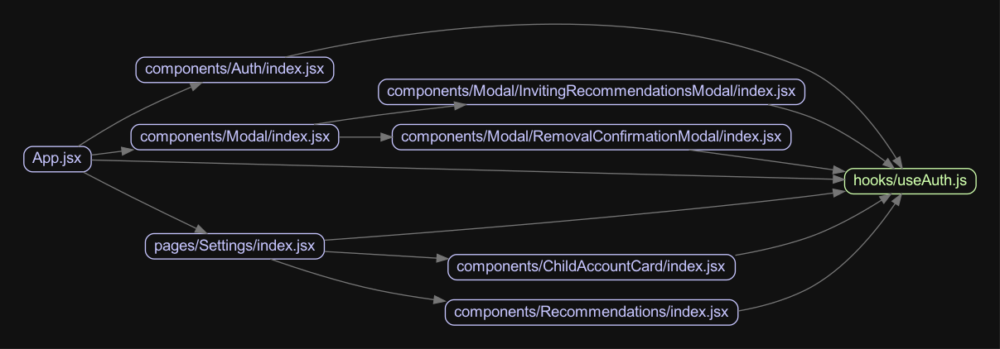

# madge-path-filter

[](https://github.com/mikhin/madge-path-filter/actions)
[](https://codeclimate.com/github/mikhin/madge-path-filter/maintainability)
[](https://codeclimate.com/github/mikhin/madge-path-filter/test_coverage)

Dependency filter for [madge](https://github.com/pahen/madge). Filters the dependency tree for the given module.

## Installation

```sh
$ npm -g install madge-path-filter
```

### Example: piping madge output through madge-path-filter

```sh
madge --json App.jsx | madge-path-filter --entry 'App.jsx' --target 'hooks/useAuth' | madge --stdin -i "image.png"
```


